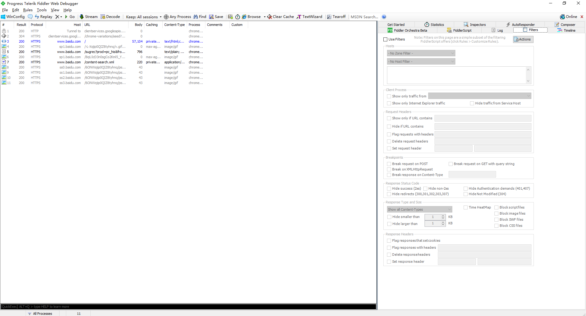
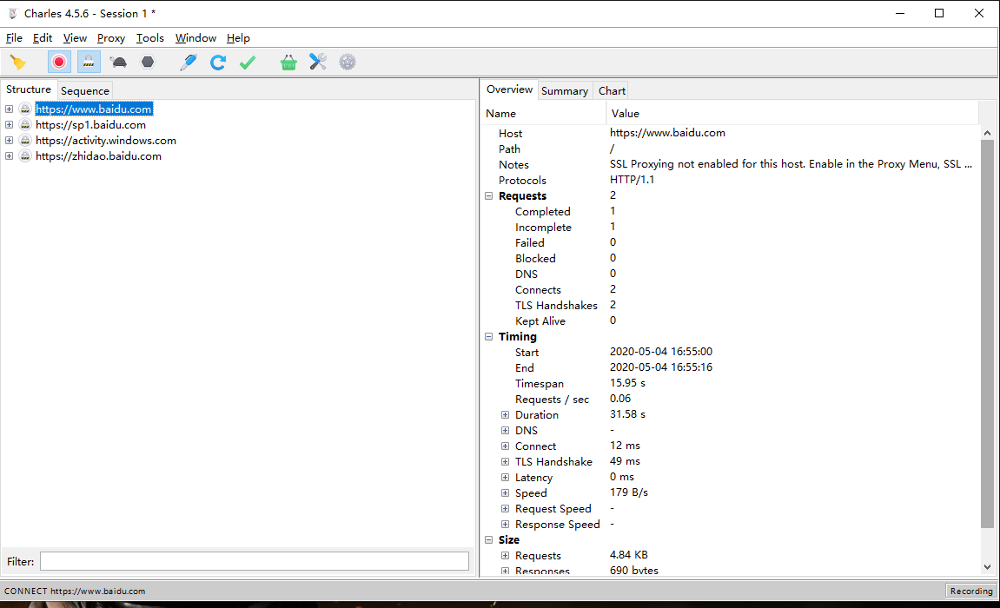
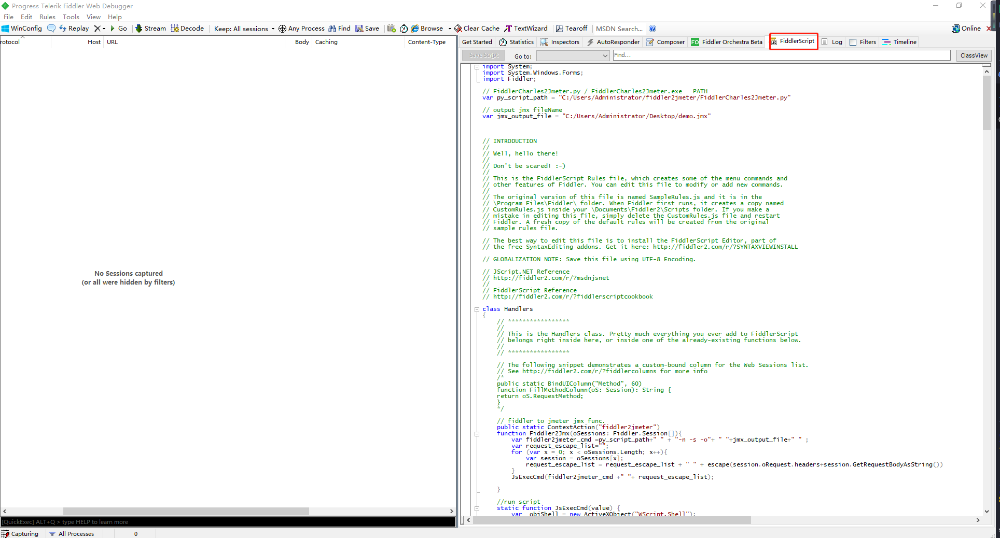
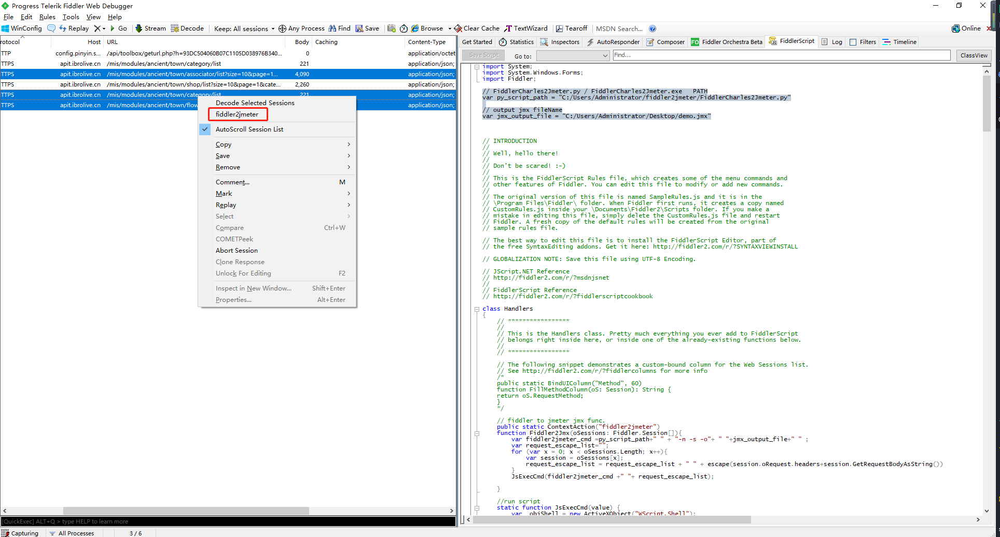

# Fiddler or Charles to Jmeter Script
<br>
To solve the problem of script recording , you can convert Fiddler or Charles into the corresponding Jmeter script to realize the parameterization of partial content. By modifying some parameters or parameterization can perform automation test or simple stress test for the interface of HTTP protocol.<br>

Chinese documents(中文文档)：https://www.cnblogs.com/fbyyx/p/12827415.html

## GUI Steps
1.1 Open Fiddler/Charles to record the request<br>
1.1.1 Recording Fiddler<br>
<br>
1.1.2 Recording Charles<br>
<br>
1.2 Export needed HTTP request<br>
1.2.1 Export Fiddler recording as saz format<br>
<br>
1.2.1 Export Charles recording as chlsj format<br>
<br>

## No-GUI Run
```text
F:\>python FiddlerCharles2Jmeter.py -h  
or 
F:\> FiddlerCharles2Jmeter.exe -h

Usage: Generate JMeter script command example:

        FiddlerCharles2Jmeter.py -n -i fiddler/charles_file_path -o jmeter_script_file_path --filter-host-name='' --filter_url='' --distinct

Options:
  -h, --help            show this help message and exit
  -n, --no_gui          no gui model
  -i INPUT_FILE_PATH, --input_file_path=INPUT_FILE_PATH
                        fiddler/charles_file_path
  -o OUTPUT_JMXSCRIPT, --output_file_path=OUTPUT_JMXSCRIPT
                        jmeter_script_file_path
  -u FILTER_URL, --filter_url=FILTER_URL
                        filter_url regex default=
                        /(.*)\.(css|ico|jpg|png|gif|bmp|wav|js|jpe)(\?.*)?$%
  -f HOST_NAME, --filter-host-name=HOST_NAME
                        filter-host-name regex default=^.*$
  -d, --distinct        distinct: Filter duplicate requests , default=False
  -s, --is-fiddler-script-model
                        fiddler script model :default=False

```
```text
示例:
    python FiddlerCharles2Jmeter.py -n -i F:\github-home\fiddler2jmeter\charles\test_http2.0.chlsj -o F:\github-home\fiddler2jmeter\charles\test_http_demo.jmx
运行成功：
    run success,jmx file saved in : F:\github-home\fiddler2jmeter\charles\test_http_demo.jmx
```
## Fiddler-Script Run
1.1 Open fiddler and replace fiddlerscript script (copy the contents of fiddlerscript.js into fiddlerscript)<br>
<br>
1.2 Modify the script path and JMX file generation path and name in the script<br>
```text
// FiddlerCharles2Jmeter.py / FiddlerCharles2Jmeter.exe   PATH
var py_script_path = "C:/Users/Administrator/fiddler2jmeter/FiddlerCharles2Jmeter.py"

// output jmx fileName
var jmx_output_file = "C:/Users/Administrator/Desktop/demo.jmx"
```
1.3 Select the request to be converted and right-click the fiddle2jmeter button to convert<br>
<br>

## Remarks
1.Ignore data with method connect.<br>
2.Only Windows systems are supported.<br>
3.JMeter version greater than 4.0 is required.<br>
4.Charles doesn't support http2.0 conversion, so it's filtered out directly.<br>


## ENV
```buildoutcfg
python >=  3.6  
PyQt5  ==  5.15.2
```

## Contact Information
1.Issues.<br>
2.WeChat ID:dongpengfei826153155<br>
3.E-mail: dongpengfei826153155@gmail.com<br>

